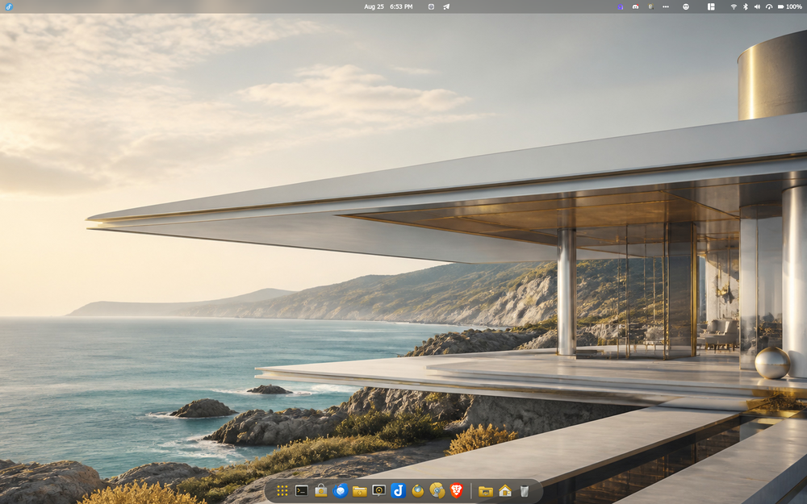
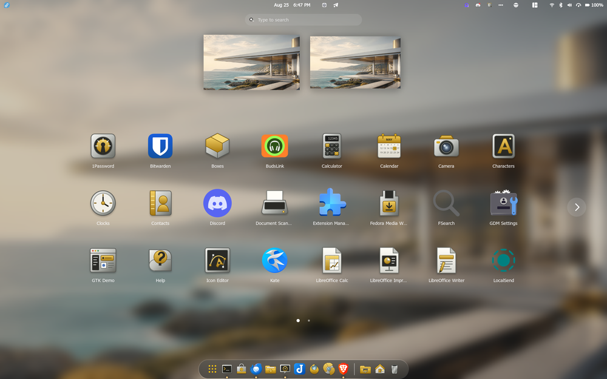
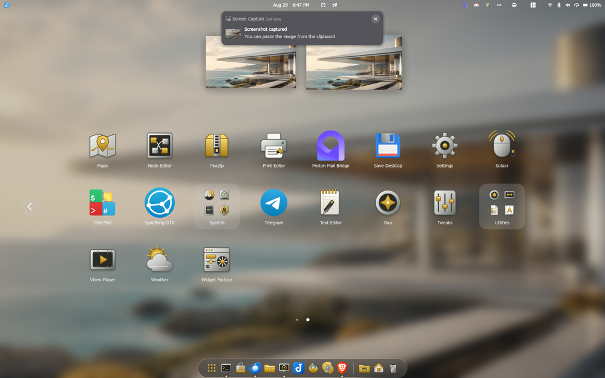
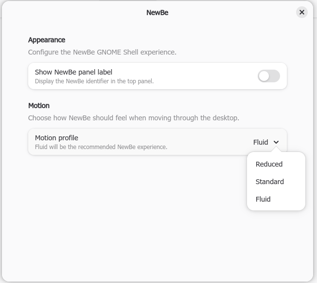
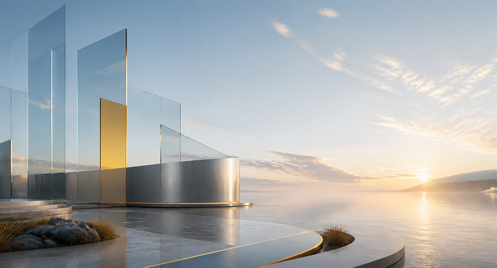
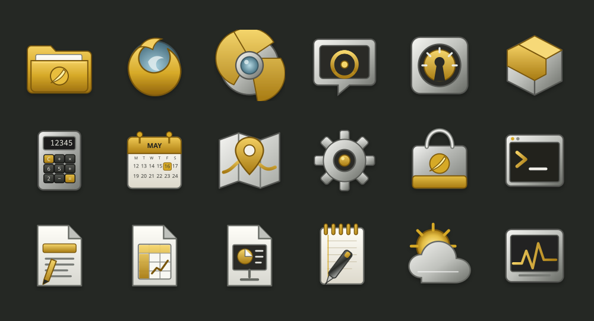
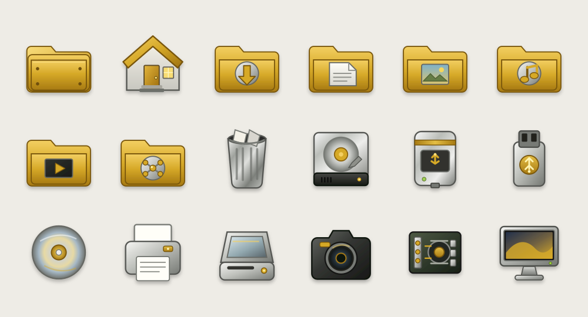
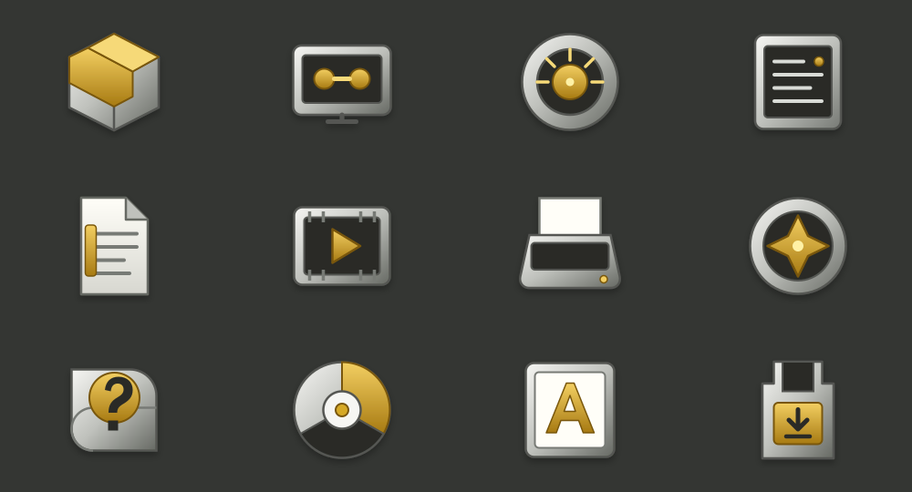
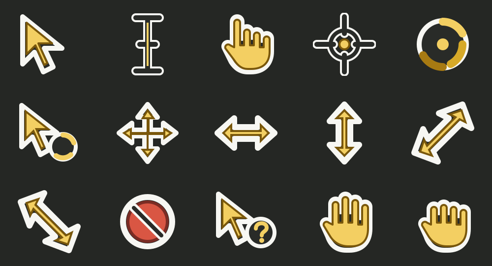

# NewBe

**NewBe** is a modern Wayland-first GNOME desktop experience inspired by the idea that BeOS continued evolving into a fluid, elegant, productivity-focused operating system.

NewBe is designed primarily for Fedora Workstation and modern GNOME, while remaining as portable as practical across current GNOME-based Linux distributions.

## Preview

The design galleries use NewBe's repository-owned artwork and SVG assets. Live
desktop screenshots also depict GNOME Shell and installed third-party
applications; their names and trademarks remain the property of their
respective owners.

### NewBe on GNOME

[](docs/screenshots/newbe-desktop-1920x1200.png)

The live test desktop shows the NewBe wallpaper, GNOME panel, dock, and installed
application icons together. Select any screenshot to open its full-resolution
1920×1200 version.

[](docs/screenshots/newbe-applications-page-1-1920x1200.png)

[](docs/screenshots/newbe-applications-page-2-1920x1200.png)

The optional extension preferences provide panel-indicator visibility and the
stored NewBe motion-profile selection:

[](docs/screenshots/newbe-extension-preferences-652x581.png)

### Glass Horizon wallpaper



### Application icons



### Places and devices



### GNOME utilities



### Cursor theme



## Design goals

- Wayland-first
- Smooth and fluid
- Modern evolution of BeOS design principles
- Compatible with GNOME Tweaks
- Modular GTK, Shell, icon, cursor, and wallpaper components
- No X11-specific hacks
- No modifications to Mutter
- No modification of GNOME system files during user installation
- Auditable installation and maintenance scripts
- Security scanning in CI
- Automated accessibility contrast and focus checks
- Clean uninstall and rollback support

## Components

- GTK 3 theme
- GTK 4 theme
- GNOME Shell theme
- NewBe icon theme
- NewBe cursor theme
- NewBe wallpaper collection
- NewBe GNOME Shell extension
- Installation and audit tools

The NewBe cursor theme includes 15 original designs, four HiDPI sizes, and standard compatibility aliases. Its editable vector sources and reproducible build details are documented in [cursors/README.md](cursors/README.md).

## Installation

Download both the release archive and its `.sha256` file into the same
directory. Verify the archive before extracting it:

```bash
sha256sum --check NewBe-0.1.0-alpha.2.tar.gz.sha256
```

After extraction, inspect the planned user-scoped changes and run the project
checks before installing:

```bash
./scripts/install.sh --dry-run
./scripts/verify.sh
./scripts/install.sh
```

The default command includes the optional GNOME Shell extension. To install the
themes, icons, cursors, and wallpapers without the extension, use:

```bash
./scripts/install.sh --without-extension
```

For automation, `--with-extension` selects the default behavior explicitly.
The two extension options are mutually exclusive. The installer requires Bash
and Python 3; `glib-compile-schemas` is required only when the extension is
included. It does not download dependencies or contact a network service.

### What the installer does

`scripts/install.sh` installs only for the current user, using
`${XDG_DATA_HOME:-$HOME/.local/share}` as its data root. It performs these
operations:

| Component | User-scoped destination | Installer behavior |
| --- | --- | --- |
| GTK and Shell themes | `themes/NewBe` and `themes/NewBe-Dark` | Rebuilds the theme output, replaces previous NewBe-owned theme directories, and copies the current files. |
| Icons and cursors | `icons/NewBe` | Replaces the previous NewBe-owned icon directory and copies the complete icon and cursor theme. |
| Wallpapers | `backgrounds/NewBe` | Copies the seven named 4K NewBe wallpapers. Unrelated files in this directory are preserved. |
| Wallpaper catalog | `gnome-background-properties/newbe.xml` | Generates GNOME Background settings metadata for the installed wallpaper paths. |
| Shell extension | `gnome-shell/extensions/newbe@infamous-pattern.github.io` | Included by default: replaces the previous NewBe extension directory, copies the extension, and compiles its local GSettings schema. `--without-extension` skips all extension writes and preserves any existing installed copy. |

The three NewBe theme/icon directories are replaced on every install. The
NewBe extension directory is replaced only when the extension is included.
Manually edited files inside those destinations should be backed up first. The
source checkout and unrelated user files are not removed.

The installer does **not**:

- require `sudo`, write under `/usr`, or modify system files;
- change the active GTK, Shell, icon, cursor, font, or wallpaper settings;
- enable the extension or install GNOME's User Themes extension;
- restart GNOME Shell or the current session; or
- collect telemetry, run downloaded code, or make network requests.

After installation, select the desired NewBe components with GNOME Tweaks.
Selecting a custom GNOME Shell theme also requires a compatible Shell-theme
loader such as GNOME's User Themes extension.

To confirm that all expected user files are present, run:

```bash
./scripts/newbe-audit.sh
```

### What the NewBe extension does

The optional extension is separate from the GTK, icon, cursor, wallpaper, and
Shell themes. Enabling it adds a styled **B / NewBe** indicator to the left side
of the GNOME top panel. Its menu reports the current light or dark appearance,
shows the selected NewBe motion profile, and opens the extension preferences.

The preferences currently provide two NewBe-owned settings:

- **Show NewBe panel label** shows or hides the complete panel indicator.
- **Motion profile** stores one of Reduced, Standard, or Fluid and displays that
  choice in the indicator menu.

At this development stage, the motion profile is descriptive extension state;
it does not change Mutter, global GNOME animations, animation timing, or other
desktop settings. The extension observes GNOME Shell's existing light/dark
color scheme only to style its own indicator and update the appearance label.

The extension does not replace system UI components, modify files, launch
processes, access the network, or change global GNOME settings. Disabling it
removes the indicator and disconnects its Shell event handlers; its two local
preferences remain available for the next time it is enabled.

Enable and configure it explicitly with:

```bash
gnome-extensions enable newbe@infamous-pattern.github.io
gnome-extensions prefs newbe@infamous-pattern.github.io
```

The extension metadata currently declares compatibility with GNOME Shell
48–50. See [docs/COMPATIBILITY.md](docs/COMPATIBILITY.md) for the tested-support
matrix.

### Uninstall and rollback

Disable the extension first, then remove the NewBe-owned user files:

```bash
gnome-extensions disable newbe@infamous-pattern.github.io
./scripts/uninstall.sh --dry-run
./scripts/uninstall.sh
```

The uninstaller removes the installed NewBe/NewBe-Dark themes, NewBe icon and
cursor theme, extension directory, seven named wallpaper files, and NewBe
wallpaper catalog. It preserves unrelated files and does not change GNOME
settings, including the active theme selections and extension enablement state.
Select non-NewBe components before uninstalling if they are currently active.

## Typography

Recommended defaults:

- Interface: IBM Plex Sans
- Monospace: IBM Plex Mono

Fonts are not hard-coded. Users remain free to select other fonts through GNOME Tweaks.

## Wallpapers

NewBe includes seven official wallpapers:

1. Desert Dawn
2. Glass Horizon
3. Brushed Arc
4. Alpine Sun
5. Coastal Pavilion
6. Floating Panels
7. Moon Reflection

[Browse and download every wallpaper in all supported sizes](assets/wallpapers/README.md). Original PNG masters and SHA-256 checksums are included.

The user installer registers all seven 4K wallpapers with GNOME Background settings. Glass Horizon automatically pairs with Moon Reflection in GNOME's light/dark background mode. Installation never changes the currently selected wallpaper.

Featured hero wallpapers:

- Glass Horizon — primary hero
- Brushed Arc — alternate light hero
- Moon Reflection — dark hero

Target resolutions:

- 1920x1080
- 1920x1200
- 2560x1440
- 2560x1600
- 3440x1440
- 3840x2160
- 5120x2160

## Security

NewBe installation scripts are intended to be readable, auditable, and reversible.

The project will use automated security and quality checks including:

- ShellCheck
- CodeQL
- dependency review
- RPM validation
- GNOME extension validation
- install/uninstall testing

NewBe will never use `curl | sh` style installation.

Accessibility expectations, automated coverage, and the manual GNOME test
matrix are documented in [docs/ACCESSIBILITY.md](docs/ACCESSIBILITY.md).

## Status

NewBe is currently in early development.

The primary target platform is Fedora Workstation 44 running GNOME 50 on
Wayland. The Shell extension is also package-validated for GNOME 48 and 49 on
Fedora 42 and 43. See [docs/COMPATIBILITY.md](docs/COMPATIBILITY.md) for the
tested-support matrix and its limits.

## License

NewBe uses a split license: software, scripts, extension code, and CSS are available under MIT; original icons, cursors, wallpapers, and preview artwork are available under CC BY-SA 4.0. Exact path coverage and full license texts are in the [`LICENSE`](LICENSE) file and [`LICENSES`](LICENSES/) directory.

## Featured visual identity

NewBe's initial hero wallpaper set is:

- Glass Horizon — primary light hero
- Brushed Arc — alternate light hero
- Moon Reflection — dark hero

These form the initial visual identity for screenshots, release artwork, and default GNOME background configuration.
